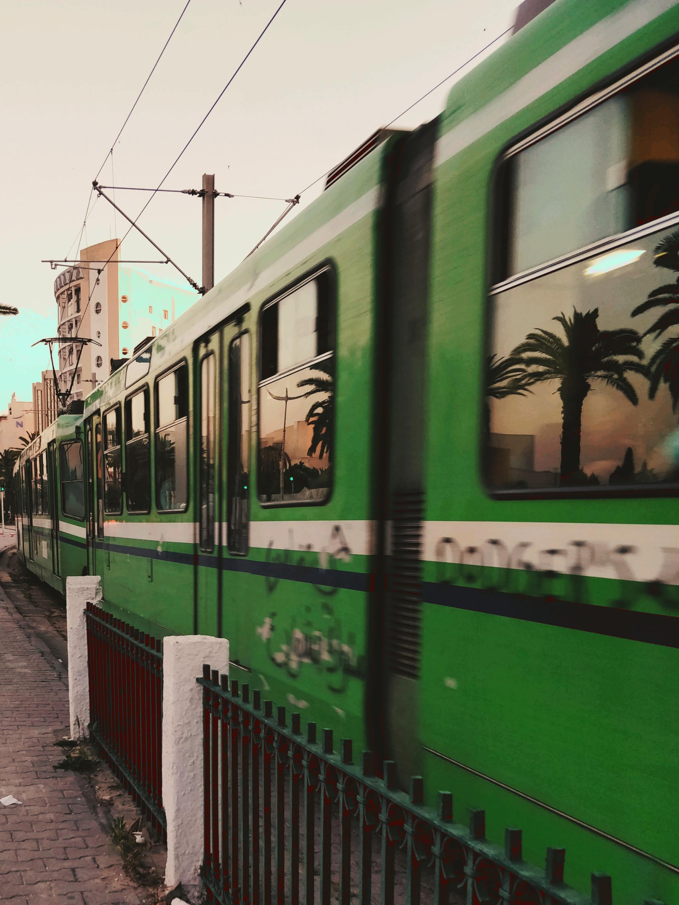

---

<figure>
  
</figure>

**9h00-9h30**: accueil

**9h30-10h30**: Première masterclass : Les nouvelles possibilités/créer de la donnée spatiale (données mobiles…)

- Introduction des enjeux par Julia (10min)

- Marie-Pierre 

- Personne d’Orange (Stefania Rubrichi possiblement)

**10h30-11h00**: Pause Café

**11h00-12h30**: Premier atelier (4 groupes thématiques)

- 1er atelier (animé par Pascale) : “Données spatiales: les basiques”

- 2ème atelier (animé par Julia) : “Manipulation des vecteurs avec R”

- 3ème atelier (animé par Antoine) : “Qgis et R: interactions et complémentarités”

- 4ème atelier (animé par JB) : “Discussions autour de la visualisation des données spatiales”

**12h30-13h30**: Pause du midi 

**13h30-14h30**: 2nd masterclass (Google Earth Engine/Raster/environnement)
Benoit Toulouse 
si pas dispo personne du CIRED ?

**14h30-15h00**: Pause café

**15h00-16h30**: Deuxième atelier (4 groupes thématiques)

- 1er atelier (animé par Pascale) : “Données spatiales: les basiques”

- 2ème atelier (animé par Julia) : “Manipulation des vecteurs avec R”

- 3ème atelier (animé par Antoine) : “Qgis et R: interactions et complémentarités”

- 4ème atelier (animé par JB) : “Discussions autour de la visualisation des données spatiales”

**16h30-17h**: Pause café

**17h-18h30**: Table ronde (Les différents langages pour la manipulation des données cartographiques en fonction des utilisations, bonnes pratiques, articulation des logiciels)

- Etienne
- Guillaume Chapelle
- Clément Gorin (numérisation des cartes)
- Clémence Laforêt

**18h30-18h45**: la suite…?

 

