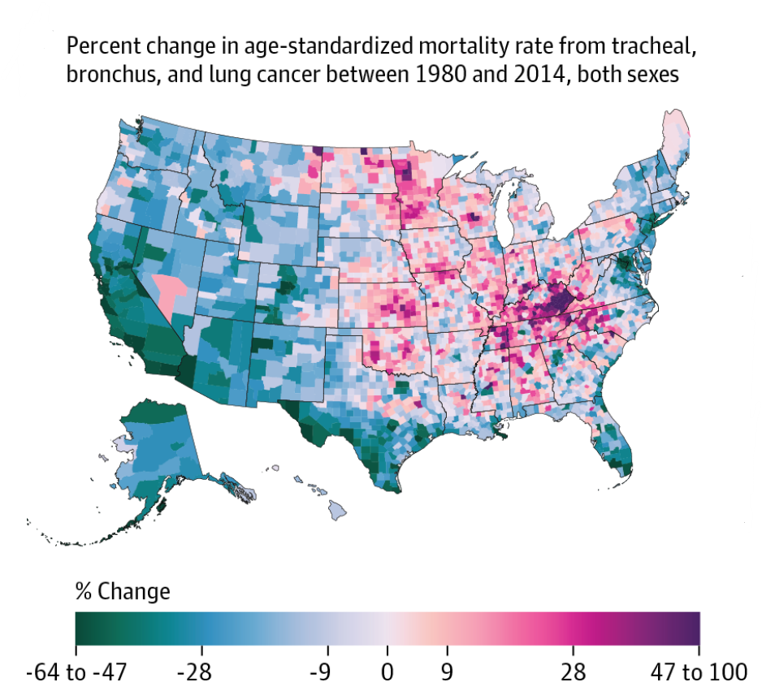
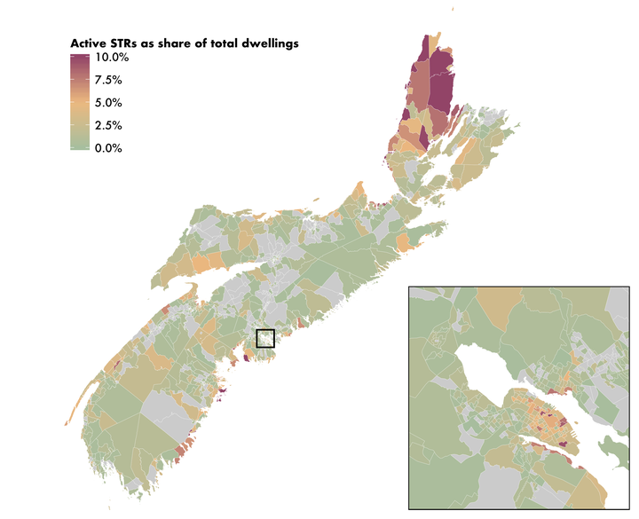

```{r setup, include=FALSE}
knitr::opts_chunk$set(echo = TRUE)
```


# Introduction

## Une carte pour présenter, illustrer et convaincre...

- Explorer des données (en les localisant)

- Une carte peut nous renseigner sur un fait (social, économique, écologique...)

- Faire émerger des questions (de recherche?) et tester des hypothèses

- Présenter une méthodologie

- Communiquer des résultats/analyses


## Qu'est-ce qu'une belle carte ?


\centering

{width=60%}


## Qu'est-ce qu'une belle carte ?

\centering

{width=70%}

Source : https://upgo.lab.mcgill.ca/2019/12/13/making-beautiful-maps/

## Qu'est-ce qu'une belle carte ?

\centering


Source : https://r-graph-gallery.com/connection-map

## Quelques observations sur les attribus d'une "bonne" carte

Qu'est-ce qui fait une carte belle et efficace?

### Zoom sur la carte thématique
La carte thématique $\rightarrow$ répartition d'un ou plusieurs phénomènes localisés (illustration d'objet géographique ou d'un attribut particulier) :

- Carte d'inventaire

- Carte d'aménagement

- Carte statistique

## Comment réaliser une "belle" carte sur R? 

\center

{width=60%}

<!---

Analyse des cartes et repérer : 

- les différentes formes + raster + fond de carte

- les projections

- les choix de couleurs et la lisibilité des choix
 

--->


<!---
- Un fond de carte

Couleurs

taille des Trait

Légendes


--->


# Prise en main de ggplot2

## Le package ggplot2

**GGPLOT2** : 

- Un package utilisé pour faire des graphiques ;

- La façon de coder respecte une grammaire qui est spécifique à ce package... Inspiré du livre "The Grammar of Graphics" (Leland Wilkinson), d'où le nom.

- Se distingue des autres outils de production graphique sous R. Permet de produire des graphiques plus élaborés et mieux finalisés que les graphiques produits avec les fonctions classiques de R.

- Dans l'écriture de la commande de création d'un graphique ou d'une carte, nous considérerons un assemblage de couches $\rightarrow$ découper les instructions.


```{r, include=F, message=FALSE, warning=FALSE}
library(sf)
library(dplyr)
library(ggplot2)

dep_france.shp <- st_read('data/dep_france_pov.shp')

```

## Le fond de carte

```{r, echo=T, message=FALSE, warning=FALSE}
map_1 <- ggplot() +
  geom_sf(data = dep_france.shp) 
map_2 <- ggplot() +
  geom_sf(data = dep_france.shp, col="grey", lwd  = 1.5, fill="NA")
```

## Le fond de carte

```{r, echo=F, fig.show="hold", out.width="48%", message=FALSE, warning=FALSE}
par(mar = c(4, 4, .1, .1))
plot(map_1)
plot(map_2)
```

## Le Nord géographique et la barre d'échelle

```{r, echo=T}
library(ggspatial)

map_1 <- ggplot() +
  geom_sf(data = dep_france.shp)+
  annotation_scale(location = "tl", 
                   pad_x = unit(0.2, "in"), 
                   bar_cols = c("grey60", "white"))

map_2 <- ggplot() +
  geom_sf(data = dep_france.shp)+
  annotation_scale(location = "tl", 
                   pad_x = unit(0.2, "in"), 
                   bar_cols = c("grey60", "white"))+
  annotation_north_arrow(location = "tl", 
                         pad_x = unit(0.3, "in"), pad_y = unit(0.3, "in"),
                         style = ggspatial::north_arrow_nautical(
                           fill = c("grey40", "white"),
                           line_col = "grey20"))

```

## Le Nord géographique et la barre d'échelle

```{r, echo=F,  fig.show="hold", out.width="48%", message=FALSE, warning=FALSE}
par(mar = c(4, 4, .1, .1))
plot(map_1)
plot(map_2)
```

## Coloration selon une variable continue et thème


```{r, echo=T}
map_1 <- ggplot() +
  geom_sf(data = dep_france.shp, aes(fill=pvrty_r))+
  annotation_scale(location = "tl", 
                   pad_x = unit(0.2, "in"), 
                   bar_cols = c("grey60", "white"))+
  annotation_north_arrow(location = "tl", 
                         pad_x = unit(0.3, "in"), pad_y = unit(0.3, "in"),
                         style = ggspatial::north_arrow_nautical(
                           fill = c("grey40", "white"),
                           line_col = "grey20"))

map_base <- ggplot() +
  geom_sf(data = dep_france.shp, aes(fill=pvrty_r))+
  annotation_scale(location = "tl", 
                   pad_x = unit(0.2, "in"), 
                   bar_cols = c("grey60", "white"))+
  annotation_north_arrow(location = "tl", 
                         pad_x = unit(0.3, "in"), pad_y = unit(0.3, "in"),
                         style = ggspatial::north_arrow_nautical(
                           fill = c("grey40", "white"),
                           line_col = "grey20"))+
  theme_void() #theme_void
  

```

## Coloration selon une variable continue et thème

```{r, echo=F,  fig.show="hold", out.width="48%", message=FALSE, warning=FALSE}
par(mar = c(4, 4, .1, .1))
plot(map_1)
plot(map_base)
```


<!---
https://www.insee.fr/fr/statistiques/6692414?sommaire=6692394#tableau-figure2_radio1
Note : dans Filosofi, le seuil de pauvreté est fixé à 60 % du niveau de vie médian de France métropolitaine.
Lecture : en 2020, en Haute-Corse, 20,1 % des personnes ont un niveau de vie inférieur au seuil de pauvreté.
Champ : France métropolitaine, Martinique et La Réunion ; personnes appartenant à des ménages fiscaux en logement ordinaire dont le revenu disponible est positif ou nul.
Sources : Insee-DGFiP-Cnaf-Cnav-CCMSA, Fichier localisé social et fiscal (Filosofi) 2020.
en %
moins de 10
de 10 à moins de 14
de 14 à moins de 18
de 18 à moins de 27
27 ou plus
--->

## Coloration selon une variable continue

```{r, echo=T}
map_1 <- map_base +
  geom_sf(data = dep_france.shp, aes(fill=pvrty_r))+
  scale_fill_gradient(low = "blue", high = "yellow")

map_2 <- map_base +
  scale_fill_viridis_c(option = "viridis") #inferno, viridis, magma

```

## Coloration selon une variable continue

```{r, echo=F,  fig.show="hold", out.width="48%", message=FALSE, warning=FALSE}
par(mar = c(4, 4, .1, .1))
plot(map_1)
plot(map_2)
```


## Coloration selon une variable binaire

```{r, echo=T}
dep_france.shp$low_poverty <- as.factor(ifelse(dep_france.shp$pvrty_r<0.12,1,0))

map_1 <- ggplot() +
  geom_sf(data = dep_france.shp, aes(fill=low_poverty))+
  annotation_scale(location = "tl", 
                   pad_x = unit(0.2, "in"), 
                   bar_cols = c("grey60", "white"))+
  annotation_north_arrow(location = "tl", 
                         pad_x = unit(0.3, "in"), pad_y = unit(0.3, "in"),
                         style = ggspatial::north_arrow_nautical(
                           fill = c("grey40", "white"),
                           line_col = "grey20"))+
   theme_void()

  
low_poverty.shp <- subset(dep_france.shp, low_poverty==1)
map_2  <- map_base +
  scale_fill_gradient(low = "blue", high = "yellow") +
  geom_sf(data = low_poverty.shp, color="red", fill="NA", lwd=1.15)

```

## Coloration selon une variable binaire

```{r, echo=F,  fig.show="hold", out.width="48%", message=FALSE, warning=FALSE}
par(mar = c(4, 4, .1, .1))
plot(map_1)
plot(map_2)
```


## Un titre et la source 

```{r, echo=T}
map_1  <- map_base +
  scale_fill_gradient(low = "blue", high = "yellow") +
  geom_sf(data = low_poverty.shp, color="red", fill="NA", lwd=1.15)+
  labs(title="Taux de pauvreté par département en 2020")

map_2  <- map_base +
  scale_fill_gradient(low = "blue", high = "yellow") +
  geom_sf(data = low_poverty.shp, color="red", fill="NA", lwd=1.15)+
  labs(title="Taux de pauvreté par département en 2020",
       caption="Sources: Insee-DGFiP-Cnaf-Cnav-CCMSA")

```


## Un titre et la source 

```{r, echo=F,  fig.show="hold", out.width="48%", message=FALSE, warning=FALSE}
par(mar = c(4, 4, .1, .1))
plot(map_1)
plot(map_2)
```


## Et maintenant l'échelle...

<!---

library(extrafont)
font_import()
font_import("Trebuchet MS")
--->


```{r, echo=T}
library(scales)
map_1  <- map_base +
  scale_fill_gradient(low = "blue", high = "yellow", labels = scales::label_percent()) +
  geom_sf(data = low_poverty.shp, color="red", fill="NA", lwd=1.15)+
  labs(title="Taux de pauvreté par département en 2020",
       caption="Sources: Insee-DGFiP-Cnaf-Cnav-CCMSA",
       fill="Taux de pauvreté")

map_2  <- map_base +
  scale_fill_gradient(low = "blue", high = "yellow", labels = scales::label_percent()) +
  geom_sf(data = low_poverty.shp, color="red", fill="NA", lwd=1.15)+
  labs(title="Taux de pauvreté par département en 2020",
       caption="Sources: Insee-DGFiP-Cnaf-Cnav-CCMSA",
       fill="Taux de pauvreté")+
  theme(plot.title = element_text(size = 12, face = "bold", color = "darkgreen", family = "serif"),
        legend.position = "bottom", 
        legend.title=element_text(size=10, family = "serif"),
        legend.text=element_text(size=8, family = "serif"))

```

## Et maintenant l'échelle...

```{r, echo=F,  fig.show="hold", out.width="48%", message=FALSE, warning=FALSE}
par(mar = c(4, 4, .1, .1))
plot(map_1)
plot(map_2)
```

## Et maintenant l'échelle...

```{r, echo=T}
library(scales)

dep_france.shp$cat_var <- as.factor(cut(dep_france.shp$pvrty_r, 
                              breaks = c(0, 0.1,0.14,0.18,0.27, 0.28), include.lowest = TRUE, labels = FALSE))


map_1  <- ggplot() +
  geom_sf(data = dep_france.shp, aes(fill=cat_var))+
  annotation_scale(location = "tl", 
                   pad_x = unit(0.2, "in"), 
                   bar_cols = c("grey60", "white"))+
  annotation_north_arrow(location = "tl", 
                         pad_x = unit(0.3, "in"), pad_y = unit(0.3, "in"),
                         style = ggspatial::north_arrow_nautical(
                           fill = c("grey40", "white"),
                           line_col = "grey20"))+
  theme_void()+
  scale_fill_manual(values = c("#FFCCCC", "#FF9999", "#FF6666", "#CC0000", "#800000")) #codes hexadécimaux


```

## Et maintenant l'échelle...

```{r, echo=F,  fig.show="hold", out.width="48%", message=FALSE, warning=FALSE}
par(mar = c(4, 4, .1, .1))
plot(map_1)
plot(map_2)
```

Nous pouvons sauvegarder...
```{r, echo=T, eval=F}
pdf('my_maps.pdf')
plot(map_1)
plot(map_2)
dev.off()
```


# Vers un peu plus de complexité...

## Ajoutons des points...

```{r, include=F, message=FALSE, warning=FALSE}
acled_france.shp <- st_read("data/acled_france.shp")
villes_france.shp <- st_read("data/Villes.gpkg")
villes_france.shp <- subset(villes_france.shp, ADM1NAME!="Corse")
```

Observations ces nouvelles données...


```{r, echo=T, message=FALSE, warning=FALSE}
map_3  <- ggplot() +
  geom_sf(data = dep_france.shp, fill="white")+
  geom_sf(data = villes_france.shp, col="black", size=2, shape=15)+
  geom_sf(data = acled_france.shp, col="red", size=0.1)
```

## Ajoutons des points...

```{r, echo=F,  fig.show="hold", out.width="48%", message=FALSE, warning=FALSE}
par(mar = c(4, 4, .1, .1))
plot(map_3)

```


## Calculer et représenter des distances

```{r, echo=T, message=FALSE, warning=FALSE}
#install.package("viridis")
library(viridis)

villes_france.shp <- st_set_crs(villes_france.shp, st_crs(acled_france.shp))
nearest_indices <- st_nearest_feature(acled_france.shp, villes_france.shp)
acled_france.shp$distances <- st_distance(acled_france.shp, villes_france.shp[nearest_indices, ], by_element = TRUE)
acled_france.shp$distances <- as.numeric(acled_france.shp$distances)/1000
map_4  <- ggplot() +
  geom_sf(data = dep_france.shp, fill="white")+
  geom_sf(data = acled_france.shp, aes(color=distances))+
  scale_size_continuous(range=c(1,12)) +
  scale_color_viridis(trans="log") +
  theme_void()

```

## Calculer et représenter des distances

```{r, echo=F,  fig.show="hold", out.width="48%", message=FALSE, warning=FALSE}
par(mar = c(4, 4, .1, .1))
plot(map_3)
plot(map_4)
```


## Comptage de points pour construire une statistique

```{r, echo=T, message=FALSE, warning=FALSE}
points_sf <- st_set_crs(acled_france.shp, st_crs(dep_france.shp))
intersections <- st_intersects(dep_france.shp, points_sf)
points_count <- sapply(intersections, length)
dep_france.shp$nb_protest <- points_count

dep_france.shp$cat_nb_protest <- as.factor(cut(dep_france.shp$nb_protest, 
                              breaks = c(0, 65, 100,130, 170, 629), include.lowest = TRUE, labels = FALSE))

map_3  <- ggplot() +
  geom_sf(data = dep_france.shp, aes(fill=nb_protest))+
  geom_sf(data = villes_france.shp, col="black", size=2, shape=15)+
  theme_void()


map_4  <- ggplot() +
  geom_sf(data = dep_france.shp, aes(fill=cat_nb_protest))+
  geom_sf(data = villes_france.shp, col="black", size=2, shape=15)+
  theme_void()+
  scale_fill_manual(values = c("#FFCCCC", "#FF9999", "#FF6666", "#CC0000", "#800000"))

```


## Comptage de points pour construire une statistique

```{r, echo=F,  fig.show="hold", out.width="48%", message=FALSE, warning=FALSE}
par(mar = c(4, 4, .1, .1))
plot(map_3)
plot(map_4)
```

## Anamorphoses en cartographie

```{r, echo=T, message=FALSE, warning=FALSE}
#install.packages("cartogram")
library(cartogram)
dep_france.shp_proj <- st_transform(dep_france.shp, crs = 2154)
dep_cartogram <- cartogram_cont(dep_france.shp_proj, "nb_protest", itermax=15)


map_3  <- ggplot() +
  geom_sf(data = dep_cartogram, aes(fill=cat_nb_protest))+
  theme_void()+
  scale_fill_manual(values = c("#FFCCCC", "#FF9999", "#FF6666", "#CC0000", "#800000"))
```


## Anamorphoses en cartographie

```{r, echo=F,  fig.show="hold", out.width="48%", message=FALSE, warning=FALSE}
par(mar = c(4, 4, .1, .1))
plot(map_3)
```


## Bubble map

```{r, echo=T, message=FALSE, warning=FALSE}
#install.packages("ggrepel")
library(ggrepel)
map_3 <- ggplot() +
  geom_sf(data = dep_france.shp, fill="grey", alpha=0.3)+
  geom_sf(data = villes_france.shp, aes(alpha=POP_MAX))+
  geom_text_repel( data=villes_france.shp %>% 
                     arrange(POP_MAX) %>% 
                     tail(10), 
                   aes(x=LONGITUDE, y=LATITUDE, label=NAME), size=5) +
  geom_point( data=villes_france.shp %>% 
                arrange(POP_MAX) %>%
                tail(10), 
              aes(x=LONGITUDE, y=LATITUDE), color="red", size=3) +
  theme_void() +
  theme(legend.position="none")

```

## Bubble map

```{r, echo=T, message=FALSE, warning=FALSE}
dep_france.shp$centroids <- dep_france.shp %>% 
  st_centroid() %>% 
  st_transform(., '+proj=longlat +ellps=GRS80 +no_defs') %>%
  st_geometry()

dep_france.shp <- dep_france.shp %>%
 arrange(desc(nb_protest))

coords <- st_coordinates(dep_france.shp$centroids)
dep_france.shp$longitude <- coords[, 'X']
dep_france.shp$latitude <- coords[, 'Y']


map_4  <- ggplot() +
    geom_sf(data = dep_france.shp, fill="grey", alpha=0.2)+
    geom_point(data = dep_france.shp, aes(x=longitude, y=latitude, size=nb_protest, color=nb_protest), alpha=0.7) +
    scale_size_continuous(range=c(1,12)) +
    scale_color_viridis(trans="log") +
  geom_sf(data = villes_france.shp, aes(alpha=POP_MAX))+
  geom_text_repel( data=villes_france.shp %>% 
                     arrange(POP_MAX) %>% 
                     tail(10), 
                   aes(x=LONGITUDE, y=LATITUDE, label=NAME), size=5) +
  geom_point( data=villes_france.shp %>% 
                arrange(POP_MAX) %>%
                tail(10), 
              aes(x=LONGITUDE, y=LATITUDE), color="red", size=3) +
    theme_void() + theme(legend.position="none")

```


## Bubble map
```{r, echo=F,  fig.show="hold", out.width="48%", message=FALSE, warning=FALSE}
par(mar = c(4, 4, .1, .1))
plot(map_3)
plot(map_4)
```

## Faire un zoom

```{r, message=FALSE, warning=FALSE}
map_3  <- ggplot() +
  geom_sf(data = dep_france.shp, fill="white")+
  geom_sf(data = villes_france.shp, col="black", size=2, shape=15)+
  geom_sf(data = acled_france.shp, col="red", size=0.1)+
  coord_sf(xlim = c(2.238558,2.486781), ylim = c(48.914092, 48.815169))+
  theme_void() 
```

## Faire un zoom

```{r, echo=F,  fig.show="hold", out.width="48%", message=FALSE, warning=FALSE}
par(mar = c(4, 4, .1, .1))
plot(map_3)
```


## Aller plus loin...

Minigraphique (histogramme)

Heatmaps

Représentation des mobilités

Cartes dynamiques/ cartes interactives

<!---

## D'autres packages


## Ressources

https://sites.google.com/site/rgraphiques/5--applications/5--realiser-des-cartes-avec-le-logiciel-r/01-bases-de-cartographie/carte-d-une-region-du-monde

https://blog.revolutionanalytics.com/2012/02/creating-beautiful-maps-with-r.html

https://www.r-bloggers.com/2021/03/making-beautiful-maps-with-ggplot/

https://sites.google.com/site/rgraphiques/5--applications/5--realiser-des-cartes-avec-le-logiciel-r/03-multicouches

https://r-graph-gallery.com/330-bubble-map-with-ggplot2.html

https://r-graph-gallery.com/choropleth-map.html

https://sjspielman.github.io/introverse/articles/color_fill_scales.html

## A ouvrir
https://github.com/r-tmap/state-of-tmap-2023/blob/main/tmap_workshop.md
https://github.com/bmericskay/GeoDataScience/blob/main/2023_GeoDataScience_FNAU.pdf
https://www.articque.com/creer-une-carte/
https://sites.google.com/site/rgraphiques/5--applications/5--realiser-des-cartes-avec-le-logiciel-r/01-bases-de-cartographie/cartographie_departements
https://blog.revolutionanalytics.com/2012/02/creating-beautiful-maps-with-r.html
https://r-graph-gallery.com/choropleth-map-in-r.html
https://sjspielman.github.io/introverse/articles/color_fill_scales.html#customizing-discrete-data-colorfill-mappings
https://www.insee.fr/fr/statistiques/6692414?sommaire=6692394#graphique-figure2_radio1

--->